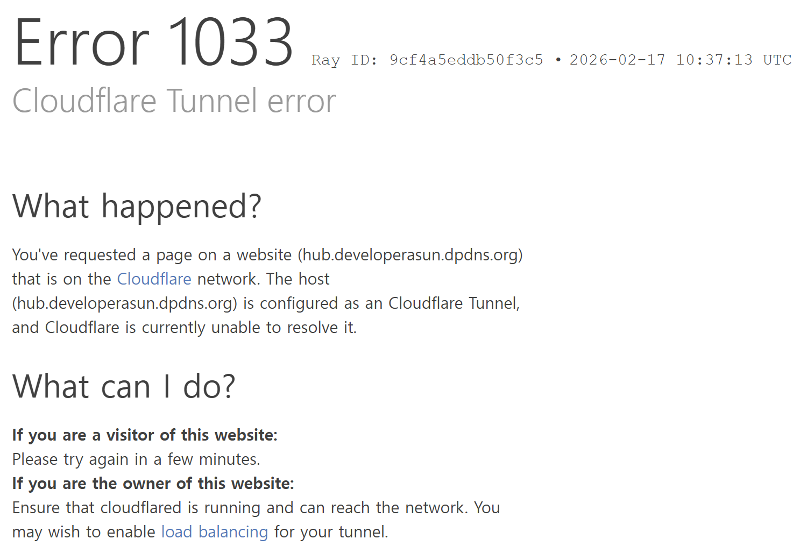

# hub

Developerasun's edge-proxy server with the help of `Caddy` and `Cloudflare`.

Mainly used for reverse proxying my side projects without exposing port and ip to the internet.

_limitation_

cloudflare tunnel requires a stable internet connection, and sometimes internet connected to my on-premise device becomes unstable.

historically, it will take around 10 minutes to get the connection back online in my setup.

## List of projects

| Project           | Deployment          | Role              |
| ----------------- | ------------------- | ----------------- |
| lollama           | on-premise          | LLM               |
| watchdog          | cloud               | monitoring        |
| kiwiwi            | standalone(CLI)     | codegen           |
| botbot            | on-premise          | discord bot       |
| minlink           | on-premise          | crypto monitoring |
| hexbook           | on-premise          | qrcode gen        |
| ricktcal-worldcup | cloud               | voting            |
| owlly             | standalone(Desktop) | reminder          |
| meowrun           | standalone(Game)    | platformer        |

## Development Environment

| Category         | Details                             |
| :--------------- | :---------------------------------- |
| **OS**           | Ubuntu 24.04.2 LTS (WSL2)           |
| **Kernel**       | 5.15.167.4-microsoft-standard-WSL2  |
| **Architecture** | x86_64                              |
| **CPU**          | 16 Threads                          |
| **RAM**          | 15 GiB (Total) / 13 GiB (Available) |
| **Storage (/)**  | 1.0 TB (Used: 41 GB / Free: 916 GB) |
| **GPU**          | Not Detected                        |
| **Last Updated** | 2026-01-24                          |
