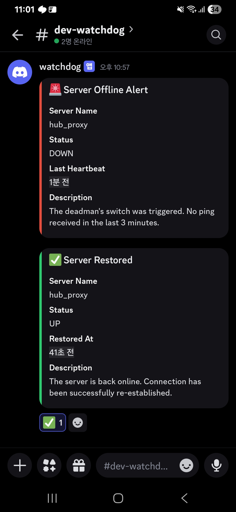
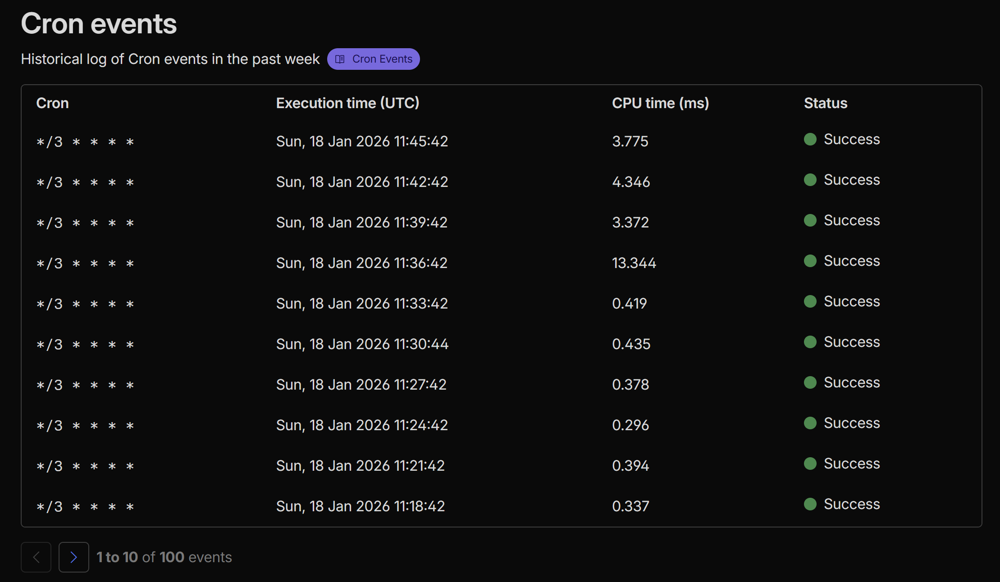

# hub_watchdog


a `hono` based http server with cron scheduler.
mainly to monitor `hub_proxy`.

<div align="center">



</div>

## usage


run a local worker with testing

```sh
./dev.run.sh
```

update secrets.

```sh
pnpm exec wrangler secret put <KEY>
```

deploy the worker.

```sh
pnpm run deploy
```

## limitation

cloudflare worker free plan has a cpu time limtation, so d1 queries should be checked if they are within the range after deployment.

<div align="center">



</div>

in v1, used in-memory global cache for checking server healthiness. this is very lightweight in cpu-perspective ()`0.3-0.4 ms`) as you can see in above screenshot.

in v2, configured d1 database to prevent uninteneded in-memory state reset because of cf worker instance change. this increased cpu-time X10 (`3~4 ms`) compared to in-memory but stays safe in terms of false-alram for healthiness status. also this caused to spike cpu time when initializing a rdb table to `13ms` as shown above.